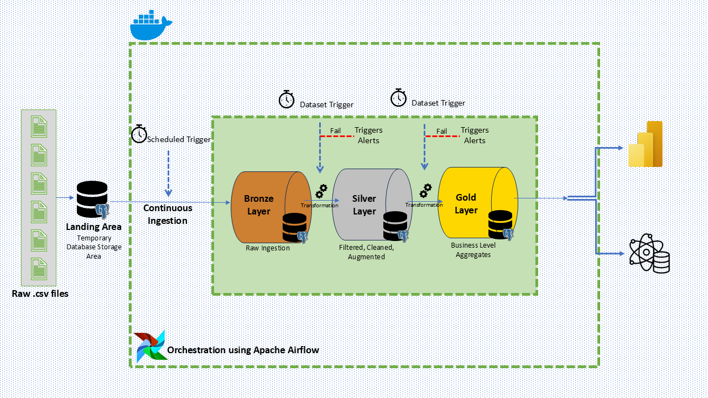

## FMCG Medallion Pipeline Project Documentation

---

## 1. Introduction

This document provides end-to-end project documentation for the FMCG Medallion Pipeline, hosted in the [Promptgiga-edge/FMCG\_Medallion\_Pipeline](https://github.com/Promptgiga-edge/FMCG_Medallion_Pipeline) repository. It describes the overall architecture, data flow, business logic, orchestration, and deployment details.

---

## 2. Business Context

Fast-moving consumer goods (FMCG) companies generate high volumes of transactional, inventory, and sales data. A robust data engineering solution is needed to ingest, process, and transform raw data into analytics-ready datasets for reporting, forecasting, and decision-making.

---

## 3. Project Objectives

* **Ingest** raw data from source systems (ERP, POS, inventory).
* **Normalize** and store raw data in the Bronze layer.
* **Cleanse** and enrich data in the Silver layer.
* **Aggregate** and model data in the Gold layer for KPIs.
* **Automate** pipelines via orchestrator (Airflow).
* **Monitor** data quality and pipeline health.

---

## 4. Architecture Overview



#### 4.1. Pipeline Layers

* **Bronze**: Raw, ingested data (immutable).
* **Silver**: Cleansed, conformed data with standard schemas.
* **Gold**: Aggregated, business-specific datasets.

#### 4.2. Technology Stack

| Layer / Component | Technology                  |
| ----------------- | --------------------------- |
| Data Storage      | PostgreSQL                  |
| Orchestration     | Apache Airflow              |
| Code & Transform  | Python (Pandas, SQLAlchemy) |
| Visualization     | Power BI                    |
| Source Control    | GitHub                      |

---

## 5. Data Tables

dim_customers.csv, 
dim_date.csv, 
dim_products.csv, 
dim_targets_orders.csv, 
fact_order_lines.csv, 
fact_orders_aggregate.csv

---

## 6. Medallion Layers

### 6.1. Bronze Layer

* **Purpose**: Landing zone; raw ingestion
* **Storage**: `bronze_customers.csv
bronze_dates.csv
bronze_order_lines.csv
bronze_orders_agg.csv
bronze_products.csv
bronze_targets.csv`
* **Transforms**: None; only type casting
* **Schema**:

  * `source_system` (STRING)
  * `raw_payload` (JSONB)
  * `ingest_timestamp` (TIMESTAMP)


### 6.2. Silver Layer

* **Purpose**: Data cleansing and conformance
* **Storage**: `silver_<entity>`
* **Transforms**:

  * Null handling
  * Type normalization (dates, numerics)
  * Referential integrity checks
  * Enrichment (lookup dimension data)


### 6.3. Gold Layer

* **Purpose**: Business-ready aggregates and metrics
* **Storage**: `gold_summary.csv`
* **Transforms**:

  * Daily sales summary
  * Inventory turnover calculation
  * SKU-level forecast inputs


---

## 7. Business Logic

1. **Daily Sales KPI**:

   * Aggregate POS transactions by store, date, SKU.
   * Calculate net sales, discounts applied, and returns.

2. **Inventory Turnover**:

   * Compute Days Inventory Outstanding (DIO) using daily closing balances.
   * Flag SKUs with DIO > threshold for restock alerts.

3. **Demand Forecasting Inputs**:

   * Generate time-series input features (lag, rolling averages).
   * Merge external calendar and promotion schedules.

---

## 8. Orchestration & Scheduling

* **Airflow DAG**: `medallion_pipeline_dag.py`
* **Schedule**: Daily at 01:00 AM
* **Tasks**:

  1. Ingest raw data (bronze)
  2. Bronze-to-Silver transforms
  3. Silver-to-Gold aggregates
  4. Data quality validation
  5. Notification on success/failure

---

## 9. Deployment & Infrastructure

* **Docker Compose** for local development:

  * Services: `postgres`, `airflow-webserver`, `airflow-scheduler`
* **Cloud Environment** (optional): AWS RDS, MWAA or GCP Composer

---

## 10. Monitoring & Alerting

* **Data Quality**: `great_expectations` integration in Silver layer
* **Airflow Alerts**: Email on failure; Slack notifications
* **Dashboard**: Pipeline health summary in Power BI

---

## 11. Security & Governance

* **Access Controls**: Role-based on PostgreSQL
* **Secrets Management**: Environment variables in Docker/Airflow

---

## 12. Getting Started

1. **Clone Repository**:

   ```bash
   git clone https://github.com/Promptgiga-edge/FMCG_Medallion_Pipeline.git
   cd FMCG_Medallion_Pipeline
   ```
2. **Configure `.env`** with DB and Airflow settings
3. **Build & Launch**:

   ```bash
   docker-compose build
   docker-compose up -d
   ```
4. **Trigger DAG** in Airflow UI

---

## 13. Contributing

* Follow the [Contributor Guidelines](CONTRIBUTING.md).
* Submit PRs for enhancements or bug fixes.

---

## 14. License

This project is licensed under the MIT License. See [LICENSE](LICENSE) for details.
